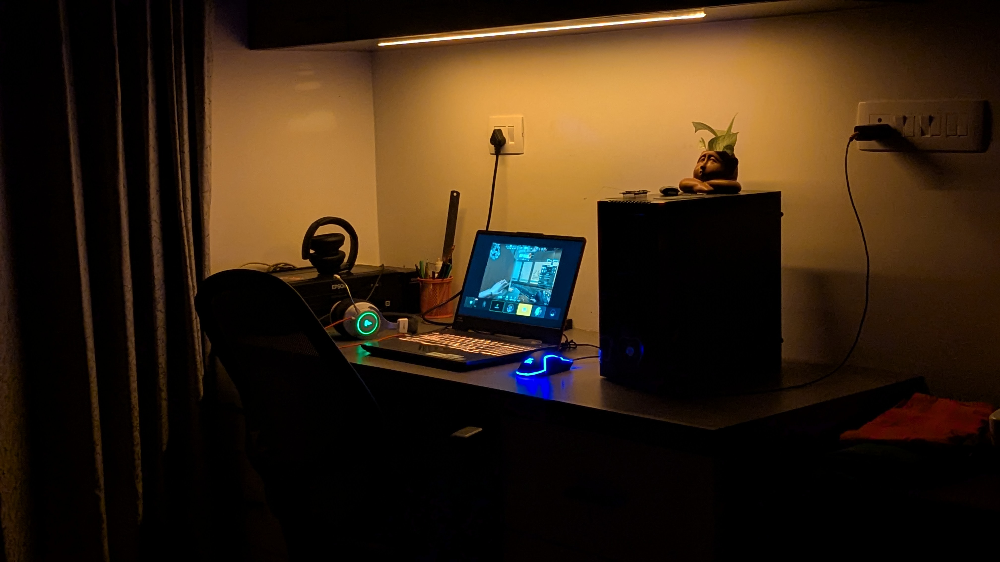

# WLED on ESP8266 with Online Flasher

## Requirements
- ESP8266 board (NodeMCU)  
- Addressable LED strip (WS2812B)  
- USB data cable  
- 5V power supply for LEDs  

## Wiring
- ESP8266 **GND** → LED strip **GND**  
- ESP8266 **D4 (GPIO2)** → LED strip **Data In**  
- LED strip **Vin** → external power supply  
- Connect all grounds together  

## Flash WLED
1. Connect ESP8266 to your computer with USB.  
2. Open [install.wled.me](https://install.wled.me).  
3. Click **Install**, choose your device, and flash.  
4. Wait until flashing completes.  

## First Setup
1. After reboot, ESP creates WiFi `WLED-AP` (password: `wled1234`).  
2. Connect and go to [http://4.3.2.1](http://4.3.2.1).  
3. Enter your WiFi details under **WiFi Setup** → Save.  
4. Reconnect to your home WiFi and find the device at `http://wled.local` or via your router.  

## Configure LEDs
- In WLED web UI → **LED Preferences**:  
  - Pin: GPIO2 (D4)  
  - LED count: number of LEDs on strip  
  - LED type: WS2812B
- Save and test effects.  

## (Optional) Set Static IP
- In WLED UI, go to **Config → WiFi Setup → Advanced**.  
  - Enable **Static IP**.  
  - Enter:  
   - IP Address: e.g. `192.168.1.50`  
   - Gateway: your router’s IP (e.g. `192.168.1.1`)  
   - Subnet: usually `255.255.255.0`   
  - Save settings and reboot ESP.  

Enjoy your Lighting WLED setup 🎉

