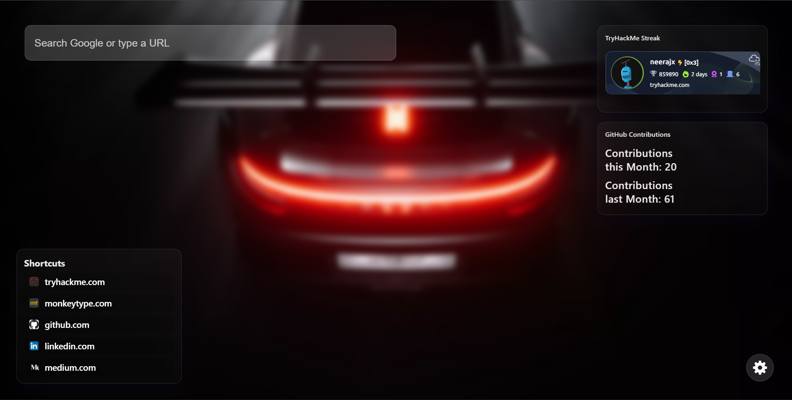

# Distraction Blocker — Personalised Minimal New Tab

A minimal Chrome extension that replaces your new tab page with a clean, distraction-free dashboard featuring:

- A Google search bar
- TryHackMe badge
- GitHub contributions (current and last month, via GraphQL API)
- Customizable background image
- Extension options/settings page

## The Idea 💡

On a random lazy day I came across the badging in TryHackMe that showed the iframe packet that changed according to the users work being done in tryhackme portal. And i started thinking, if I had such an extension that shows my cuurent streak and badge count on my homescreen it can motivate me to maintain that streak. But unfortunatly no such extention was seen in Chrome web store. So I though what is I made such an extension. I went to ChatGPT's extension GPT module and started telling my requirements. and it gave me a working extension but with a shitty UI. Next I did some research and started working on this project and made a glassy type modern and aesthically pleasing UI design with the help of Github Co-pilot. 

## Features

- **Google Search Bar:**
  - Search Google or type a URL directly from the new tab.
- **TryHackMe Badge:**
  - Displays your TryHackMe public profile badge.
- **GitHub Contributions:**
  - Shows your GitHub contributions for the current and previous month (requires a GitHub personal access token for accurate data).
- **Custom Background:**
  - Set your own background image URL in the options page.
- **Settings Page:**
  - Change your TryHackMe ID, GitHub username, GitHub token, and background image.
 

## Setup & Installation

1. **Clone or Download** this repository.
2. **Open Chrome** and go to `chrome://extensions/`.
3. Enable **Developer mode** (top right).
4. Click **Load unpacked** and select this project folder.
5. The extension will now override your new tab page.

## Configuration

- Click the extension icon and choose **Options** (or go to the options page).
- Enter your TryHackMe ID, GitHub username, background image URL, and GitHub personal access token (PAT).
- Save your settings.

### How to get a GitHub Personal Access Token
1. Go to [GitHub Tokens](https://github.com/settings/tokens)
2. Click **Generate new token**
3. Give it a name and select `read:user` scope
4. Copy the token and paste it in the options page

## File Structure

- `manifest.json` — Chrome extension manifest
- `newtab.html` — Main new tab page
- `newtab.js` — Logic for new tab (background, GitHub, TryHackMe)
- `options.html` — Settings/options page
- `options.js` — Logic for saving/loading settings
- `styles.css` — All styles
- `icons/` — Extension icons

## Permissions
- `storage` — To save your settings
- `https://tryhackme.com/*` — To fetch your TryHackMe badge
- `https://github.com/*` — To fetch your GitHub contributions

## Notes
- This extension is for personal use and does not track or share your data.
- Your GitHub token is stored locally in Chrome's sync storage.

